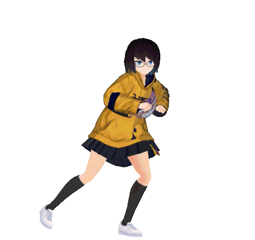

# Welcome to my corner of the playground. It contains various of ~~useless~~ files and projects. :upside_down_face:

<h2 align='center'>Contents</h2>

	

**Project 1**
- Creating and implementing signature ~~**(Don't full screen)**~~ **fixed**

	<h3>
	⠀⠀⠀⠀⠀⠀⠀⠀⠀⠀⠀⠀⠀⠀⠀⠀⠀⠀⠀⠀⠀⠀⠀⠀⠀⣀⣀⣄⠀⠀⠀⠀⠀⠀⠀⠀⠀⠀
	⠀⢠⣤⣤⣤⣤⣀⣀⡀⠀⠀⠀⠀⠀⠀⠀⠀⢀⣀⣀⣀⣀⣤⣔⣭⠗⠚⢢⢣⠀⠀⠀⠀⠀⠀⠀⠀⠀
	⠀⠈⡇⡖⣲⣯⣩⡙⠻⠿⣷⠾⠫⠋⣻⣻⡉⠁⠈⣠⣴⣲⡿⣿⣿⣿⣧⠀⢃⡇⠀⠀⠀⠀⠀⠀⠀⠀
	⠀⠀⢳⣳⠹⣿⡿⠿⣷⣶⣧⠶⢲⣾⠿⣽⢷⡷⠋⠿⣧⣿⣠⣾⣿⣿⣿⠇⣧⡇⠀⠀⠀⠀⠀⠀⠀⠀
	⠀⠀⠈⠫⣳⣌⢿⣮⢟⡥⠉⠀⢰⠋⠀⣳⠟⠀⠀⠀⠈⠙⠻⣿⣿⠿⢋⣼⣼⠀⠀⠀⠀⠀⠀⠀⠀⠀
	⠀⠀⠀⠀⠓⣎⣿⢋⢬⡙⡄⠀⠞⢀⣴⣯⣀⣤⣄⡀⠀⠀⠀⠀⠛⣷⣿⠈⢿⡄⠀⠀⠀⠀⠀⠀⠀⠀
	⠀⠀⠀⠀⢠⢏⢇⡬⠳⢏⠉⢻⠀⡟⢁⣵⣇⣠⣈⠈⠉⠓⢦⣄⡸⢄⡈⠻⢄⢹⣶⠀⠀⠀⠀⠀⠀⠀
	⠀⠀⠀⣠⠮⢛⣁⣬⣷⣾⣧⣏⣲⣿⠾⠛⠛⣛⠛⠻⣶⣤⣀⣁⡉⠿⢷⣤⣄⡀⠙⢶⡶⠀⠀⠀⠀⠀
	⠀⠀⠀⣧⣺⠁⠀⠀⠀⠀⢹⣿⡷⣇⠀⠀⠀⠈⠉⠓⢹⣾⣷⣶⣾⣐⡤⣉⠙⠯⣀⠀⠘⢻⣅⡀⠀⠀
	⢀⣠⡲⣫⣿⣄⠀⠀⠀⠀⣼⠟⠈⠻⣿⡀⠀⠀⠀⢀⣾⣿⣿⣿⣿⣿⣿⣶⣱⢦⡿⣖⢄⠐⣽⡟⠀⠀
	⣰⠟⠴⣿⣿⣿⣷⣄⣠⣴⢯⣖⠉⡶⠛⢿⣶⣦⣶⣿⣿⣿⣿⣿⣿⣿⣿⣿⡟⠉⣹⠧⠼⡿⠃⠀⠀⠀
	⠙⠷⣌⡻⣿⣿⣿⣿⣿⢱⣿⣿⣿⡆⠀⠀⢉⡻⢿⣿⣿⣿⣿⣿⠿⣟⣿⣶⡾⢯⣑⠻⣹⠃⠀⠀⠀⠀
	⠀⠀⠀⠛⠚⠭⣟⣿⡟⣢⣝⣻⣍⣠⠤⢴⣛⣉⣀⣠⣍⣿⣿⣾⣿⣿⣟⢥⡞⢠⣫⡾⢧⡀⠀⠀⠀⠀
	⠀⠀⠀⠀⠀⠀⠀⠐⠛⢙⣿⣿⣭⣥⣶⣿⣾⣿⣿⣿⣿⣿⣿⣿⣿⣿⡿⢋⡷⠚⠉⠀⢀⠉⡳⠀⠀⠀
	⠀⠀⠀⠀⠀⠀⠀⢀⣴⣏⣯⠜⢻⣿⣿⣿⣿⣿⣿⣿⣿⣿⣿⢯⣿⠿⢊⡥⠖⠚⢹⣭⡁⣼⠇⠀⠀⠀
	⠀⠀⠀⠀⠀⠀⠀⢸⣼⣿⠁⠀⣾⣿⣿⣿⣿⣿⣿⣿⠻⣷⡼⢋⡠⠖⠉⣀⣴⣾⣿⢋⣛⣿⡆⠀⠀⠀
	⠀⠀⠀⠀⠀⡠⣞⣵⣷⢹⠀⢠⣿⣿⡿⣿⣿⣿⠟⡞⣳⢋⠞⣋⣤⣶⣿⣿⣿⣿⣿⡿⡿⢿⣿⣷⡄⠀
	⠀⠀⠀⠀⣼⣰⢻⣿⣿⡏⣧⢸⣿⡷⡿⠋⣿⡯⠋⡴⣳⣷⣿⣿⣿⡻⢷⣿⣿⢟⡟⢆⠈⢫⡻⣿⣷⠀
	⠀⠀⢀⣜⠟⡇⣿⣿⣿⣿⡿⣾⣿⠟⣱⣿⡏⣠⡎⣏⣿⢯⣿⣿⣿⣿⣿⣿⡏⠈⠀⠨⣷⠭⣟⡼⣿⡀
	⠀⣠⣺⣋⣀⣷⣿⣿⣿⣿⣇⣿⣿⣧⣟⣿⣿⣿⢨⣿⢁⣾⣿⣿⣿⣿⣿⣳⠃⢀⡴⠊⠁⠀⠀⡇⣾⣧
	</h3>

- [x] Completed

**Project 2**
- Creating a simple game with said signature
- Guessing game

- [x] Completed

The List of Listing List
-----------------------
- [x] Raccoon
- [x] Has no idea what must be done :upside_down_face:
- [x] Create Repo
- [x] Start Collabin
- [x] Create signature _(Could add more or not, depends if I feel lazy or not)_
- [x] Create a simple game
- [x] Did some README's
- [ ] Create API
- [ ] Create a functioning API
- [ ] Automate / Automation
- [ ] Milk :milk_glass:
- [x] Creating a Branch
- [x] Creating Issue
- [x] Creata a Pull request

