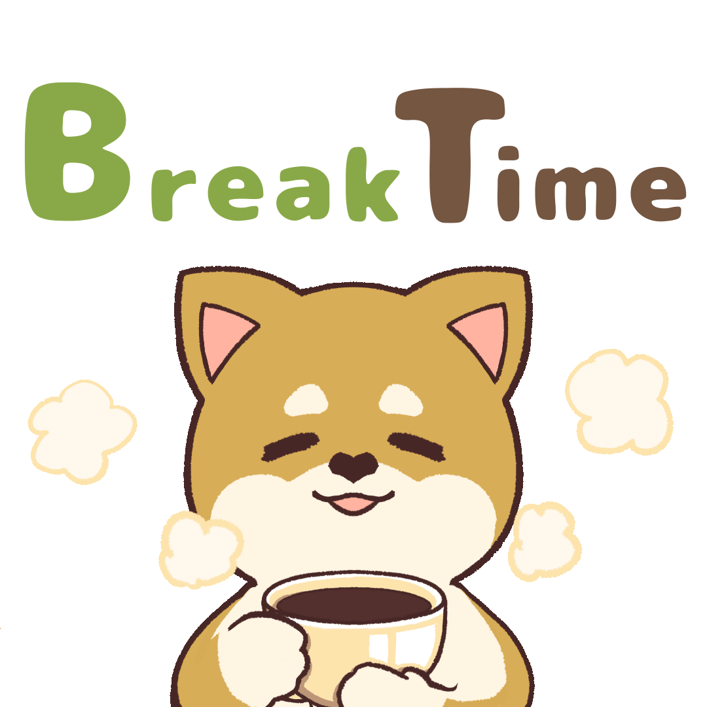

	

ToDo Lists
-----------------------
[ ] Create some projects
	- simple calculator [x]
	- Use Shoe to create simple GUI (under construck):traffic_light:
[x] Create a signature
[ ] Learn/pickup HTML/CSS :thinking: (useful):flying_saucer:

<h1 align='center'>STILL UNDER CONSTRUCTION</h1>
 

	

 /\_/\   /\_/\   /\_/\   /\_/\   /\_/\   /\_/\   /\_/\   /\_/\   /\_/\  
( o.o ) ( o.o ) ( o.o ) ( o.o ) ( o.o ) ( o.o ) ( o.o ) ( o.o ) ( o.o ) 
 > ^ <   > ^ <   > ^ <   > ^ <   \_^_/   > ^ <   > ^ <   > ^ <   > ^ <  

