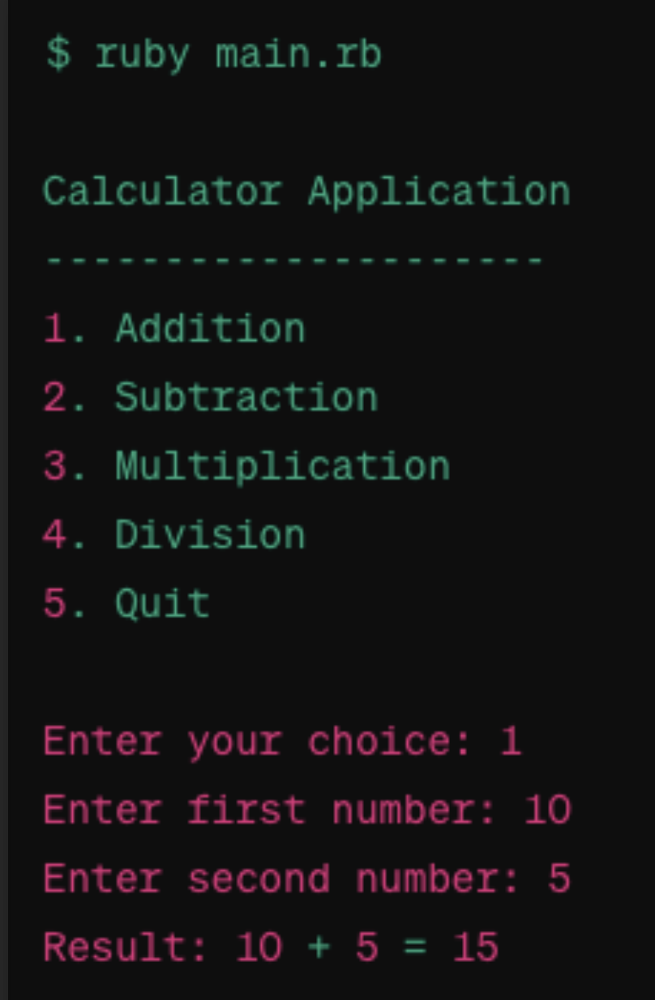

# Project ONE
--------------
How it should look
<!--

-->

	

## Title: Simple Calculator

| Features | :white_check_mark: |
|   :---:  |               ---: |
| Addition | :x: |
| Subtraction | :x: |
| Division | :x: |
| handle invalid inputs | :x: |

### By creating this basic command-line application Ruby.
[ ] Learn basic commands of Ruby